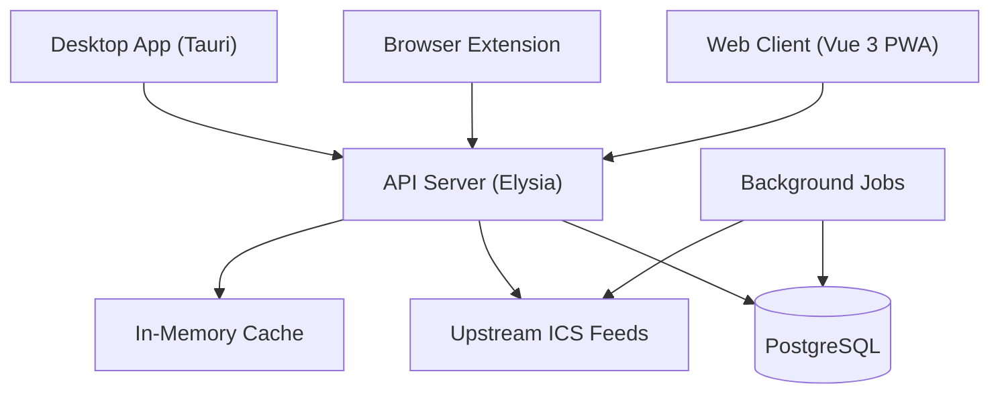

PlanningSup is a modern, offline-first PWA that converts ICS calendar feeds into a rich calendar interface. This page explains the architecture and key design decisions.

## System overview



## Technology stack

### Runtime and tools

- **Bun** - Primary runtime for API and build tooling
- **Bun workspaces** - Monorepo management
- **Node.js 24** - Required for certain tooling
- **Docker** - Containerization and PostgreSQL

### Backend

<CardGroup cols={2}>
  <Card title="Elysia" icon="zap">
    Fast, type-safe web framework for Bun with automatic OpenAPI generation
  </Card>
  <Card title="Drizzle ORM" icon="database">
    Type-safe ORM with `bun:sql` adapter for PostgreSQL
  </Card>
  <Card title="BetterAuth" icon="shield">
    Authentication library with passkey support and OAuth providers
  </Card>
  <Card title="ical.js" icon="calendar">
    ICS parsing library for calendar event extraction
  </Card>
</CardGroup>

### Frontend

<CardGroup cols={2}>
  <Card title="Vue 3" icon="vuejs">
    Reactive UI framework with Composition API
  </Card>
  <Card title="Vite" icon="bolt">
    Fast build tool with HMR
  </Card>
  <Card title="DaisyUI" icon="palette">
    Tailwind CSS component library
  </Card>
  <Card title="Workbox" icon="box">
    Service worker for offline PWA functionality
  </Card>
</CardGroup>

### Testing

- **Bun test** - Unit and integration tests
- **Playwright** - End-to-end browser tests

## Architecture principles

### Offline-first

PlanningSup is designed to work without network connectivity:

1. **Service worker** caches app shell and assets
2. **Database backups** store ICS data for offline access
3. **Network-first strategy** with DB fallback
4. **Background sync** refreshes stale data when online

### Type safety

End-to-end type safety across the stack:

- **Drizzle** generates types from database schema
- **Elysia** provides runtime validation with compile-time types
- **Eden Treaty** enables type-safe API client (`packages/libs/src/client/`)
- **BetterAuth** generates session and user types

<Note>
Clients use the Eden Treaty client instead of raw `fetch()` for automatic type inference and IDE autocomplete.
</Note>

### Monorepo structure

Bun workspaces organize code into focused packages:

- **`apps/*`** - Deployable applications
- **`packages/*`** - Shared libraries and configs
- **`resources/*`** - Static data (planning JSON files)
- **`test/*`** - Test suites

Dependencies are hoisted to the root, with workspace references for internal packages.

## Data flow

### Planning request lifecycle

<Steps>
  <Step title="Client requests planning">
    ```bash
    GET /api/plannings/enscr.elevesing1iereannee?events=true
    ```
  </Step>
  
  <Step title="API resolves planning">
    The API:
    1. Looks up planning in `flattenedPlannings` (loaded from JSON at startup)
    2. Deduplicates concurrent requests for the same planning
    3. Attempts to fetch ICS from upstream URL
  </Step>
  
  <Step title="Network-first strategy">
    <Tabs>
      <Tab title="Network success">
        - Parse ICS events
        - Return formatted events
        - Asynchronously write to database backup
      </Tab>
      <Tab title="Network failure">
        - Check database for backup
        - Return cached events if available
        - Enqueue refresh retry (for transient failures)
      </Tab>
    </Tabs>
  </Step>
  
  <Step title="Client renders events">
    Vue components display events in calendar views (day, week, month)
  </Step>
</Steps>

### Event parsing pipeline

```typescript
// Simplified event parsing flow
const icsData = await fetch(planning.url)
const parsed = icalJs.parse(icsData)
const events = extractEvents(parsed)
const formatted = formatEvents(events, {
  blocklist,
  highlightTeacher,
  timezoneConversion,
  categoryDetection,
})
```

Event formatting includes:
- **Blocklist filtering** - Hide events matching keywords
- **Category detection** - Classify as lecture/lab/tutorial
- **Timezone conversion** - Convert between user and target timezones
- **Teacher highlighting** - Identify events missing teacher info
- **Location cleanup** - Normalize location strings

### Database backup system

PlanningSup maintains PostgreSQL backups for offline resilience:

<Tabs>
  <Tab title="Backup tables">
    **`plannings`**
    - Metadata for each planning (fullId, title, etc.)
    
    **`plannings_backup`**
    - ICS event data (JSON column)
    - Last updated timestamp
    
    **`plannings_refresh_state`**
    - Last successful fetch
    - Consecutive failures
    - Disabled until timestamp
    
    **`plannings_refresh_queue`**
    - Priority queue for background refreshes
    - Retry attempts and next attempt time
  </Tab>
  
  <Tab title="Backfill job">
    Runs every 10 minutes (configurable):
    
    1. Find plannings without backups or with stale data
    2. Prioritize by last refresh timestamp
    3. Fetch and store ICS data
    4. Update refresh state
    5. Handle failures with exponential backoff
  </Tab>
  
  <Tab title="Refresh worker">
    Processes the refresh queue:
    
    1. Poll for ready queue items
    2. Lock item for processing
    3. Fetch ICS data
    4. Update backup if changed
    5. Remove from queue on success or max attempts
  </Tab>
</Tabs>

### Background jobs

Jobs run when `RUN_JOBS=true`:

<CodeGroup>
```typescript plannings-backfill
// Ensures all plannings have fresh backups
while (running) {
  const stale = findStalePlannings()
  for (const planning of stale) {
    await refreshPlanning(planning)
  }
  await sleep(BACKFILL_INTERVAL_MS)
}
```

```typescript plannings-refresh-worker
// Processes retry queue for failed fetches
while (running) {
  const items = pollQueue()
  for (const item of items) {
    try {
      await refreshPlanning(item.planningFullId)
      await removeFromQueue(item)
    } catch {
      await incrementAttempts(item)
    }
  }
}
```
</CodeGroup>

**Quiet hours** - Reduce job activity during specified time windows:

```bash
JOBS_QUIET_HOURS=21:00-06:00
```

During quiet hours:
- Backfill interval increases
- Refresh retries are delayed
- Workers remain idle unless queue is very backed up

## Authentication system

### BetterAuth integration

When `AUTH_ENABLED=true`, PlanningSup uses BetterAuth for:

- **OAuth providers** - Discord, GitHub
- **Passkey authentication** - WebAuthn/FIDO2
- **User preferences sync** - Syncs settings across devices

### User data model

BetterAuth extends the user table with custom fields:

```typescript
user: {
  additionalFields: {
    theme: string,
    highlightTeacher: boolean,
    showWeekends: boolean,
    mergeDuplicates: boolean,
    blocklist: string[],
    plannings: string[],
    customGroups: string,  // JSON string
    colors: string,        // JSON string
    prefsMeta: string,     // JSON timestamps
  }
}
```

### Preferences sync

`apps/web/src/composables/useUserPrefsSync.ts` implements bidirectional sync:

<Steps>
  <Step title="On app load">
    Fetch user session and preferences from API
  </Step>
  
  <Step title="Merge with local">
    Use `prefsMeta` timestamps to resolve conflicts:
    - If server value is newer, use it
    - If local value is newer, push to server
  </Step>
  
  <Step title="Watch for changes">
    When user modifies a setting:
    1. Update local state immediately
    2. Debounce API call (avoid excessive requests)
    3. Push change to server
    4. Update `prefsMeta` timestamp
  </Step>
</Steps>

## API design

### OpenAPI documentation

Elysia automatically generates OpenAPI specs from route definitions:

```typescript
api.get('/plannings/:fullId', handler, {
  params: t.Object({
    fullId: t.String({ description: 'Full planning ID' }),
  }),
  query: t.Object({
    events: t.Optional(t.String()),
    onlyDb: t.Optional(t.String()),
    // ...
  }),
  detail: {
    summary: 'Get planning by ID',
    description: '...',
    tags: ['Plannings'],
  },
})
```

This provides:
- Automatic request validation
- Type-safe parameters
- OpenAPI schema generation
- API documentation UI

### Response schemas

API responses include structured metadata:

```typescript
interface PlanningEventsResponse {
  id: string
  fullId: string
  title: string
  refreshedAt: number | null
  backupUpdatedAt: number | null
  status: 'ok' | 'error'
  source: 'network' | 'db' | 'none'
  reason: 'network_error' | 'no_data' | 'empty_schedule' | null
  events: Event[] | null
  nbEvents: number
}
```

Clients can use this metadata to show appropriate UI states.

### Eden Treaty client

Type-safe API client in `packages/libs/src/client/`:

```typescript
import { client } from '@libs/client'

// Fully typed request and response
const res = await client.api.plannings[fullId].get({
  query: { events: 'true', blocklist: 'exam,test' }
})

if (res.data) {
  // res.data is typed as PlanningEventsResponse
  console.log(res.data.events)
}
```

## Frontend architecture

### Vue 3 Composition API

All components use `<script setup>` with Composition API:

```vue
<script setup lang="ts">
import { ref, computed } from 'vue'
import { useUserPrefsSync } from '@/composables/useUserPrefsSync'

const { prefs, updatePref } = useUserPrefsSync()
const theme = computed(() => prefs.value.theme)

function toggleTheme() {
  updatePref('theme', theme.value === 'dark' ? 'light' : 'dark')
}
</script>
```

### State management

PlanningSup uses Vue's reactivity system and composables rather than Vuex/Pinia:

- **`useUserPrefsSync`** - User preferences and auth
- **`usePlanning`** - Selected planning and events
- **`useCalendar`** - Calendar view state

### PWA architecture

**Service worker** (`apps/web/public/sw.js`):
- Precaches app shell and critical assets
- Uses Workbox for cache strategies
- Handles offline fallbacks

**Manifest** (`apps/web/public/manifest.json`):
- Defines PWA metadata
- Icon sets for all platforms
- Display mode and theme colors

**Installation** - Users can install PlanningSup:
- Desktop via browser prompt
- Mobile via "Add to Home Screen"
- Tauri for native desktop experience

## Desktop and mobile

### Tauri application

`apps/app/` wraps the Vue PWA in a native shell:

- **Rust backend** - Native OS integration
- **Web frontend** - Reuses Vue app
- **Deep links** - OAuth callback handling
- **System tray** - Quick access on desktop

### Browser extension

`apps/extension/` provides one-click planning access:

- Reads university domain from current tab
- Opens planning page with pre-selected university
- Available on Chrome Web Store

## Performance optimizations

### Request deduplication

Concurrent requests for the same planning are coalesced:

```typescript
const inflight = new Map<string, Promise<Result>>()

if (inflight.has(key)) {
  return await inflight.get(key)  // Reuse existing request
}

const promise = fetchEvents(url)
inflight.set(key, promise)
try {
  return await promise
} finally {
  inflight.delete(key)
}
```

### Database indexing

Critical indexes for query performance:

- `plannings_backup.planning_full_id` - Unique index for O(1) lookups
- `plannings_refresh_queue.next_attempt_at` - Index for queue polling
- `plannings_refresh_state.disabled_until` - Index for filtering disabled plannings

### Caching strategies

- **Planning metadata** - Loaded once at startup, cached in memory
- **ICS data** - Network-first with DB fallback
- **Static assets** - Precached by service worker
- **API responses** - No server-side caching (always fresh)

## Security considerations

### Input validation

All API inputs are validated with Elysia's type system:

```typescript
.get('/:fullId', handler, {
  params: t.Object({
    fullId: t.String(),  // Validated automatically
  }),
})
```

### CORS configuration

Strict CORS policy using `TRUSTED_ORIGINS`:

```typescript
cors({
  origin: config.trustedOrigins,
  credentials: true,
  allowedHeaders: ['Content-Type', 'Authorization'],
})
```

### Operations security

Admin endpoints require `x-ops-token` header:

```typescript
if (!isAuthorized(request.headers)) {
  return { status: 404, error: 'NOT_FOUND' }
}
```

In production, missing `OPS_TOKEN` makes endpoints return 404 (not 401) to avoid discovery.

### Authentication security

- **Passkeys** - FIDO2/WebAuthn for phishing-resistant auth
- **OAuth** - Uses BetterAuth's secure flow with state validation
- **Session tokens** - HTTP-only cookies with CSRF protection
- **Rate limiting** - Built into BetterAuth (100 req/min, 5 req/10s for passkeys)

## Monitoring and operations

### Health endpoints

**`/api/ping`** - Simple health check:
```bash
curl http://localhost:20000/api/ping
# Returns: pong
```

**`/api/ops/plannings`** - Detailed system health:
```bash
curl -H "x-ops-token: TOKEN" http://localhost:20000/api/ops/plannings
```

Returns:
- Queue statistics (depth, ready, locked)
- Backup coverage (total, covered, disabled)
- Worker states (backfill, refresh worker)
- Recent failures by host and planning
- Last backup write info

### Logging

Structured logging with Elysia logger:

```typescript
elysiaLogger.info('Serving events for {fullId}', { fullId, nbEvents })
elysiaLogger.warn('Failed to refresh {fullId}: {error}', { fullId, error })
```

### Docker health checks

Built into the image:

```dockerfile
HEALTHCHECK --interval=30s --timeout=5s \
  CMD ["/bin/sh", "-c", "wget -qO- http://localhost:20000/api/ping"]
```

Container orchestrators use this to monitor application health.

## Deployment architecture

### Single-server deployment

```
┌─────────────────────────┐
│  Reverse Proxy (Nginx)  │  :443 HTTPS
└──────────┬──────────────┘
           │
┌──────────▼──────────────┐
│  PlanningSup Container  │  :20000
│  (API + PWA)            │
└──────────┬──────────────┘
           │
┌──────────▼──────────────┐
│  PostgreSQL Container   │  :5432
└─────────────────────────┘
```

### High-availability deployment

```
┌─────────────────────────┐
│    Load Balancer        │
└──────────┬──────────────┘
           │
     ┌─────┴─────┐
     │           │
┌────▼───┐  ┌───▼────┐
│ API 1  │  │ API 2  │
└────┬───┘  └───┬────┘
     │          │
     └─────┬────┘
           │
  ┌────────▼────────┐
  │  PostgreSQL     │
  │  (Primary)      │
  └────────┬────────┘
           │
  ┌────────▼────────┐
  │  PostgreSQL     │
  │  (Replica)      │
  └─────────────────┘
```

## Future architecture considerations

<Info>
**Potential enhancements:**

- Redis for distributed caching and job queues
- Separate job worker containers (horizontal scaling)
- GraphQL API for complex client queries
- WebSocket support for real-time updates
- S3/object storage for planning JSON files
- Multi-region deployment with geo-routing
</Info>

## Next steps

<CardGroup cols={2}>
  <Card title="Contributing" icon="code-pull-request" href="/developers/contributing">
    Start contributing to PlanningSup
  </Card>
  <Card title="API reference" icon="code" href="/api/overview">
    Explore the API endpoints
  </Card>
</CardGroup>